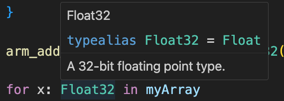

# README

This is a quick experiment with embedded swift and CMSIS-DSP.

## How to build

The initial `CMakeLists.txt` was generated with CMSIS build tools. As consequence you need an installation of the CMSIS build tools and the CMSIS packs that are used by this example.

As you can see from the `CMakeLists.txt`, the packs used are:

```
"${CPACK}/ARM/CMSIS-DSP/1.15.0"
"${CPACK}/ARM/CMSIS/6.0.0
"${CPACK}/ARM/V2M_MPS3_SSE_300_BSP/"

```

You need to customize the `CMakeLists.txt` to use the right configuration from the CMSIS build tools:

```
set(TOOLCHAIN_VERSION_MIN "18.1.3")
include ("${CTOOLS}/etc/CLANG.18.1.3.cmake")
```

Here we use the ARM clang that you can get here : https://github.com/ARM-software/LLVM-embedded-toolchain-for-Arm

When all is installed and configured, you can do:

```shell
mkdir -p cprj/tmp/test/VHT-Corstone-300/Release
cd build
cmake -DPROJ="....swift-bare-metal" \
  -DCPACK="....cpacks" \
  -DCTOOLS="....ctools" \
  ..
```

The paths are:

* Path to this project
* Path to the pack folder used by CMSIS build tools
* Path to the CMSIS build tools (containing a folder etc with .cmake files for the compilers)

Once `cmake` as been used, you now have a `Makefile` and can type `make` to build.

## How to run

Now you can run the generated `.elf` on a `FVP_Corstone_SSE-300`

## How to edit

You can use `vscode` to have the Swift completion and color syntax highlighting.



## Problems


Embedded swift does not yet support the `v8.1m` architecture. CMSIS-DSP is compiled with `v8.1m` and supports Helium.


Embedded swift in this example is targetting `armv7em-none-none-eabi` and I mix both at the end ... so it is not very clean but it works on this example (I don't claim it will always work)